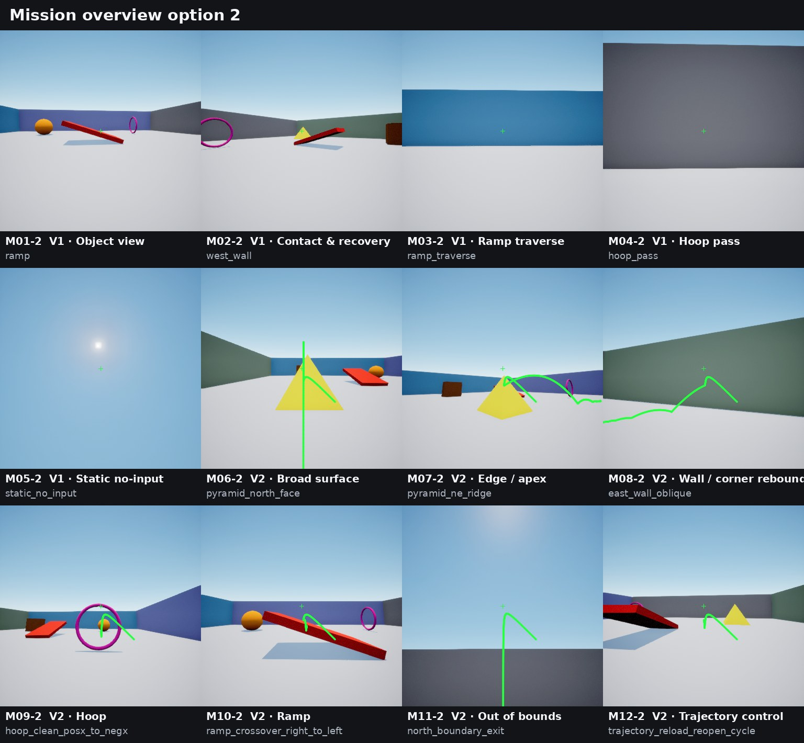
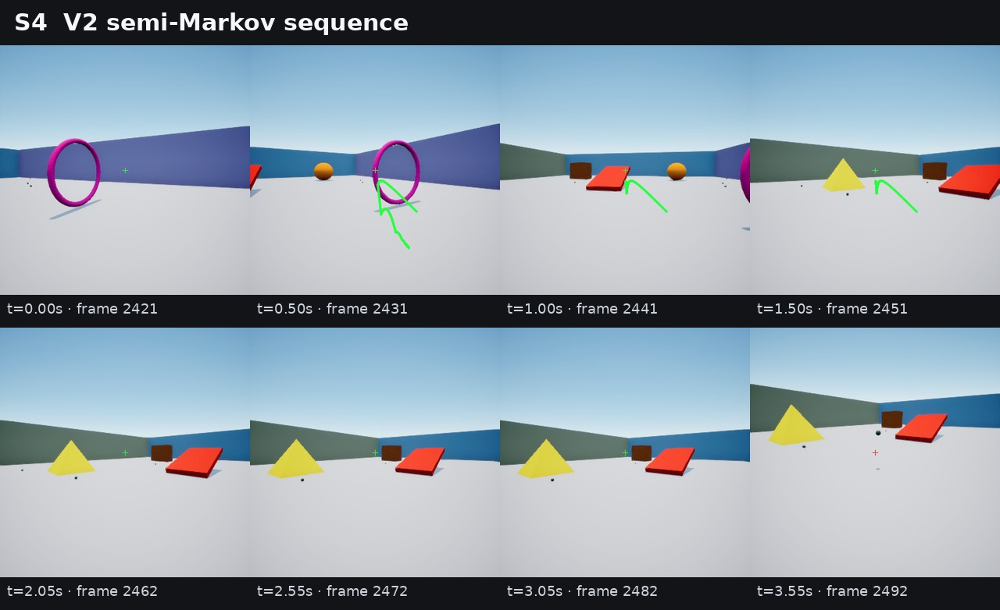
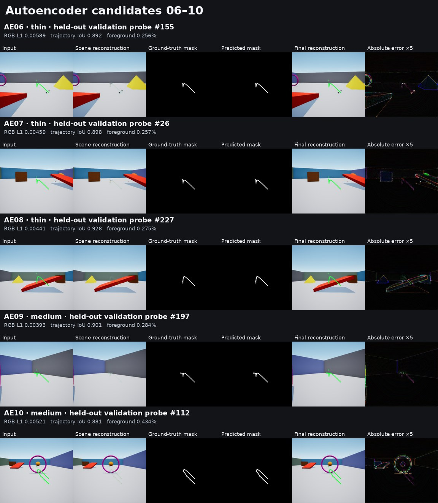

# Trajectory World Model

This repository documents a personal experiment in action-conditioned visual
prediction. The project is built around a custom Unreal Engine simulator that
generates first-person sequences containing player movement, camera motion,
projectile throws, a rendered projectile trajectory, and a Ready/Cooldown
crosshair state.

The two completed parts of the project are:

1. generating and validating a structured simulator dataset; and
2. training a factorized autoencoder for the scene, trajectory, and crosshair.

This repository now contains the dataset-generation orchestration, shard and
split utilities, and factorized-autoencoder implementation used for those two
stages. The recurrent world model is the next step and remains a work in
progress; its implementation is not part of this code release.

## At a glance

| Item | Current result |
| --- | ---: |
| RGB frames | 3,381,548 |
| Aligned frame-to-frame transitions | 3,369,945 |
| Recorded episode instances | 11,603 |
| Underlying episode identities | 6,149 |
| Resolution | 384 x 384 |
| Observation rate | 20 Hz |
| Dataset shards | 363 |
| Compressed shard size | 322.28 GiB |
| Final autoencoder parameters | 196,861 |

## Repository contents

| Path | Contents |
| --- | --- |
| `data_generation/` | Mission catalogs, deterministic planners, packaged-build workers, shard finalization, validation, review rendering, and generator regression tests |
| `src/world_model_trajectory/data/` | Tar-shard readers, distributed sampling, episode-safe split loading, and crosshair canonicalization |
| `src/world_model_trajectory/models/` | Plain, comparison, factorized, and final factorized autoencoders |
| `src/world_model_trajectory/training/` | Reconstruction and renderer-aware autoencoder objectives |
| `scripts/` | Dataset migration/inspection and autoencoder training, evaluation, calibration, rendering, and smoke-test entry points |
| `configs/autoencoder/` | Configuration for the accepted final autoencoder |
| `tests/` | Dataset and autoencoder regression tests |

The dataset-generation code drives a compatible packaged simulator build. The
Unreal Engine project, game assets, and packaged build are not included. The
build may or may not be made public in the future; there is no promise or
release schedule.

Install the Python dependencies with:

```bash
python -m pip install -r requirements.txt
```

Generator-only dependencies and operating notes are in
[`data_generation/README.md`](data_generation/README.md).

After installing both requirement files, run the public regression suite with:

```bash
python -m pytest -q
```

## Dataset generation

The dataset was generated entirely in a custom Unreal Engine environment. The
arena contains walls, a ramp, a hoop, a pyramid, a rectangle, and a sphere.
Collection recipes vary player position, movement, camera direction, target,
path, approach style, projectile arc, and interaction outcome.



The overview above samples the major V1 and V2 mission families, including
object viewing, contact and recovery, ramp and hoop traversal, projectile
contacts, boundary exits, and trajectory-state control.

The simulator records images and structured metadata together. This makes it
possible to reconstruct not only what appeared on screen, but also which
control was applied, what changed between two frames, which mission was being
performed, and how each projectile interacted with the environment.

### What is an episode?

An episode is one temporally ordered simulator recording. It starts from a
seeded initial configuration, follows one collection recipe, and ends when the
recipe completes, succeeds, fails, or reaches its time limit.

Each episode contains:

- an initial observation at frame `0`;
- a contiguous sequence of RGB observations;
- one transition record for every adjacent frame pair;
- one episode-level metadata record;
- frame-level simulator state and mission metadata.

For a source frame `t`, the transition row keyed by that frame stores the
control applied during:

```text
frame_t + action_t -> frame_(t+1)
```

This alignment is important: actions are attached to the transition they
cause, rather than to the resulting frame.

Episodes vary considerably in length. Across both collections, the median is
107 frames (5.35 seconds) and the mean is 291.4 frames (14.57 seconds). Long
semi-Markov episodes can run for the configured maximum of approximately 150
seconds, while targeted missions usually stop soon after their objective and
post-success observation period are complete.

### Shard and metadata layout

The dataset is stored in tar shards. Each shard contains compressed RGB frames
and three Parquet tables:

```text
shard-*.tar
|-- episodes/<episode_id>/frame-000000.webp
|-- episodes/<episode_id>/frame-000001.webp
|-- ...
|-- episodes.parquet
|-- frames.parquet
|-- transitions.parquet
`-- manifest.json
```

| Table | One row represents | Main contents |
| --- | --- | --- |
| `episodes.parquet` | One complete episode | identity, seed, recipe, requested and actual length, mission family/type, target and region, mission parameters, success state, coverage, projectile summary, and termination reason |
| `frames.parquet` | One rendered observation | frame index, RGB key, player pose and velocity, camera rotation, contacts, crosshair and cooldown state, trajectory visibility, projectile counts and states, mission phase, and coverage state |
| `transitions.parquet` | One `t -> t+1` transition | source-frame index, key/button state, movement and camera axes, request edges, accepted/rejected events, cooldown changes, and associated projectile identity |

The control metadata includes ten current key/button states, three request or
edge indicators, and four continuous axes:

- movement and interaction keys: `W`, `A`, `S`, `D`, arrow keys, `Q`, and `E`;
- request/edge signals: projectile-request edge and `Q` rising/falling edges;
- continuous controls: forward, right, pitch, and yaw axes.

The metadata also retains post-transition outcomes for analysis, including
request acceptance, rejection reason, cooldown before and after the action,
and the accepted projectile identifier. Projectile records include launch
position and velocity, camera pose, physics configuration, realized contacts,
bounce count, rest frame, visibility, and preview-to-flight parity.

### Dataset collections

The final corpus combines two complementary collection versions:

| Collection | Focus | Episode instances | Frames | Share of all frames |
| --- | --- | ---: | ---: | ---: |
| V1 | movement, camera behavior, object interaction, and general arena coverage | 6,144 | 1,152,179 | 34.07% |
| V2 | projectile trajectories, controlled contacts, rebounds, crossings, exits, and trajectory-state changes | 5,459 | 2,229,369 | 65.93% |
| **Total** |  | **11,603** | **3,381,548** | **100.00%** |

Percentages below are calculated from the frames actually present in the
canonical dataset, not only from the planned collection budget. A frame is
assigned to its episode's primary mission, including any setup and
post-success tail frames in that episode.

### V1 mission distribution

V1 mixes long free-form episodes with shorter targeted locomotion and camera
missions.

| Mission | Purpose | Episodes | Frames | Share of V1 |
| --- | --- | ---: | ---: | ---: |
| Semi-Markov | Long mixed sequences of movement, camera control, aiming, and actions | 265 | 795,265 | 69.02% |
| Object view | Approach, observe, orbit, or pass arena objects from varied viewpoints | 2,497 | 151,376 | 13.14% |
| Contact and recovery | Approach geometry, establish contact, and recover using varied movement styles | 1,899 | 127,128 | 11.03% |
| Hoop pass | Cross the hoop from either direction using centered or oblique paths | 736 | 37,580 | 3.26% |
| Ramp traverse | Move uphill or downhill along centered and diagonal paths | 730 | 37,430 | 3.25% |
| Static no-input | Stationary reference sequences in which the visual state should remain stable | 17 | 3,400 | 0.30% |
| **Total** |  | **6,144** | **1,152,179** | **100.00%** |

The targeted V1 recipes vary details such as object target, orbit direction,
viewing mode, gaze pattern, ramp direction, path profile, facing direction,
contact approach, and recovery style.

### V2 mission distribution

V2 dedicates roughly 70% of its frames to long semi-Markov sequences and 30%
to certified projectile missions:

| Source | Episodes | Frames | Share of V2 |
| --- | ---: | ---: | ---: |
| Semi-Markov | 519 | 1,557,519 | 69.86% |
| Targeted projectile missions | 4,940 | 671,850 | 30.14% |
| **Total** | **5,459** | **2,229,369** | **100.00%** |

The 4,940 targeted episodes cover 62 mission types grouped into seven
families:

| Mission family | What it covers | Types | Episodes | Frames | Share of V2 |
| --- | --- | ---: | ---: | ---: | ---: |
| Object edges and apexes | Pyramid ridges/apex and rectangle horizontal or vertical edges | 13 | 1,079 | 141,349 | 6.34% |
| Broad object surfaces | Pyramid and rectangle faces, rectangle top, and sphere quadrants | 13 | 1,157 | 139,997 | 6.28% |
| Wall and corner rebounds | Direct/oblique wall contacts and two-wall corner sequences | 12 | 904 | 130,344 | 5.85% |
| Hoop | Clean and offset crossings in both directions | 10 | 770 | 108,570 | 4.87% |
| Ramp | Surface hits, lips, side edges, and left/right crossovers | 8 | 606 | 86,886 | 3.90% |
| Out of bounds | Projectile exits through each arena boundary | 4 | 268 | 43,148 | 1.94% |
| Trajectory control | Manual trajectory toggle and reload/reopen cycles | 2 | 156 | 21,556 | 0.97% |
| **Targeted total** |  | **62** | **4,940** | **671,850** | **30.14%** |

<details>
<summary>All 62 V2 mission types</summary>

**Broad object surfaces (13):** `pyramid_east_face`,
`pyramid_north_face`, `pyramid_south_face`, `pyramid_west_face`,
`rectangle_east_face`, `rectangle_north_face`, `rectangle_south_face`,
`rectangle_top_surface`, `rectangle_west_face`, `sphere_east_quadrant`,
`sphere_north_quadrant`, `sphere_south_quadrant`, and
`sphere_west_quadrant`.

**Object edges and apexes (13):** `pyramid_apex`, `pyramid_ne_ridge`,
`pyramid_nw_ridge`, `pyramid_se_ridge`, `pyramid_sw_ridge`,
`rectangle_east_upper_edge`, `rectangle_ne_vertical_edge`,
`rectangle_north_upper_edge`, `rectangle_nw_vertical_edge`,
`rectangle_se_vertical_edge`, `rectangle_south_upper_edge`,
`rectangle_sw_vertical_edge`, and `rectangle_west_upper_edge`.

**Wall and corner rebounds (12):** `east_wall_direct`,
`east_wall_oblique`, `north_east_corner_two_wall`, `north_wall_direct`,
`north_wall_oblique`, `north_west_corner_two_wall`,
`south_east_corner_two_wall`, `south_wall_direct`, `south_wall_oblique`,
`south_west_corner_two_wall`, `west_wall_direct`, and `west_wall_oblique`.

**Hoop (10):** `hoop_clean_negx_to_posx`, `hoop_clean_posx_to_negx`,
`hoop_left_negx_to_posx`, `hoop_left_posx_to_negx`,
`hoop_lower_negx_to_posx`, `hoop_lower_posx_to_negx`,
`hoop_right_negx_to_posx`, `hoop_right_posx_to_negx`,
`hoop_upper_negx_to_posx`, and `hoop_upper_posx_to_negx`.

**Ramp (8):** `ramp_crossover_left_to_right`,
`ramp_crossover_right_to_left`, `ramp_downhill_surface`,
`ramp_high_end_lip`, `ramp_left_side_edge`, `ramp_low_end_lip`,
`ramp_right_side_edge`, and `ramp_uphill_surface`.

**Out of bounds (4):** `east_boundary_exit`, `north_boundary_exit`,
`south_boundary_exit`, and `west_boundary_exit`.

**Trajectory control (2):** `trajectory_manual_toggle_cycle` and
`trajectory_reload_reopen_cycle`.

</details>

Semi-Markov collection complements the targeted missions with longer sequences
that change movement, camera direction, observed objects, and action state over
time:



### Episode-safe data split

The train/validation/test split is deterministic and grouped by underlying
episode identity. Frames from one identity never appear in more than one
partition, and the same identity is assigned to the same partition if it is
present in both collection versions.

| Split | Frames | Share | Underlying episode identities |
| --- | ---: | ---: | ---: |
| Training | 3,043,394 | 90.00% | 5,534 |
| Validation | 169,082 | 5.00% | 307 |
| Test | 169,072 | 5.00% | 308 |
| **Total** | **3,381,548** | **100.00%** | **6,149** |

This grouping produced zero cross-split episode conflicts. Sequence windows
must also remain within an episode; the final frame of one episode is never
connected to the first frame of another.

### Data availability

The dataset is not public. It may or may not be released in the future, and
there is no commitment or release schedule.

## Factorized autoencoder

The completed autoencoder turns each RGB frame into a compact state with three
separate components:

| Component | Shape | Values | Represents |
| --- | ---: | ---: | --- |
| Scene latent | `8 x 48 x 48` | 18,432 | arena appearance, viewpoint, objects, and projectiles |
| Trajectory latent | `1 x 96 x 96` | 9,216 | the rendered projectile-trajectory geometry |
| Crosshair state | scalar | 1 | exact Ready (`0`) or Cooldown (`1`) state |
| **Learned spatial state** |  | **27,648** | scene and trajectory latents combined |

### Architecture and separation

The scene and trajectory branches are independent RGB autoencoders. They do
not share encoder parameters, and both receive only the original RGB frame as
input. Renderer-derived masks and future metadata are not encoder inputs.

The decoder paths are deliberately isolated:

```text
scene latent      -> scene RGB decoder
trajectory latent -> trajectory-mask decoder
crosshair scalar  -> deterministic fixed-stencil renderer
```

The final image is composed in the order `scene -> trajectory -> crosshair`.
The trajectory target is extracted from the simulator's canonical green
renderer color for supervision, while the crosshair can be read and rendered
exactly because its geometry and colors are fixed. The crosshair path therefore
requires no learned parameters.

The selected model has:

- scene base width: 24;
- trajectory base width: 12;
- 196,861 trainable parameters;
- 27,648 learned spatial latent values per frame.

### Training setup

The final autoencoder was trained from scratch on the complete training
partition.

| Setting | Value |
| --- | ---: |
| Training frames processed | 3,043,394 |
| Training passes over the split | 1 |
| GPUs | 4 |
| Precision | BF16 |
| Effective batch size | 128 images |
| Optimizer | AdamW |
| Learning rate | 0.0003 |
| Weight decay | 0.0001 |
| Optimizer steps | 24,293 |
| Training time | 6,041.57 seconds |

The objective supervises the scene reconstruction, full-frame trajectory
mask, final composed image, edges, trajectory-colored pixels, crosshair pixels,
and trajectory overlap. Full-frame trajectory supervision includes background
pixels so that predicting trajectory everywhere is heavily penalized.

### Held-out reconstruction results

The final training evaluation on the held-out validation probe recorded:

| Metric | Result |
| --- | ---: |
| Final RGB L1 | 0.00463 |
| Scene RGB L1 | 0.00457 |
| Trajectory precision | 0.9970 |
| Trajectory recall | 0.9197 |
| Trajectory F1 | 0.9568 |
| Trajectory IoU | 0.9171 |
| Crosshair pixel mismatches | 0 |

The following held-out examples show the input, scene-only reconstruction,
ground-truth trajectory mask, predicted trajectory mask, final composed
reconstruction, and amplified absolute error:



Full-resolution panels: [AE06](docs/images/autoencoder/ae-06.jpg),
[AE07](docs/images/autoencoder/ae-07.jpg),
[AE08](docs/images/autoencoder/ae-08.jpg),
[AE09](docs/images/autoencoder/ae-09.jpg), and
[AE10](docs/images/autoencoder/ae-10.jpg).

The autoencoder implementation, accepted training configuration, evaluation
code, and dataset readers are included in this repository. Checkpoints and
training data are not included.

## World model: work in progress

The next stage is an action-conditioned recurrent model operating on the
factorized state. Its intended step is:

```text
current latent state + current action + recurrent memory
    -> next latent state + updated memory
```

Longer predictions will feed predicted latent states directly back into the
model rather than repeatedly decoding and re-encoding images. This part is
still experimental and is not presented as a completed result. This section
will be updated when the next-state and multi-step rollout behavior is reliable
enough to share.

## Repository status

This is an evolving personal experiment rather than a finished library or a
promised release. The current public boundary is the dataset-generation tooling,
dataset/shard utilities, and autoencoder code. Simulator source, assets,
packaged builds, datasets, checkpoints, experiment storage, and recurrent
world-model implementation are not included.


